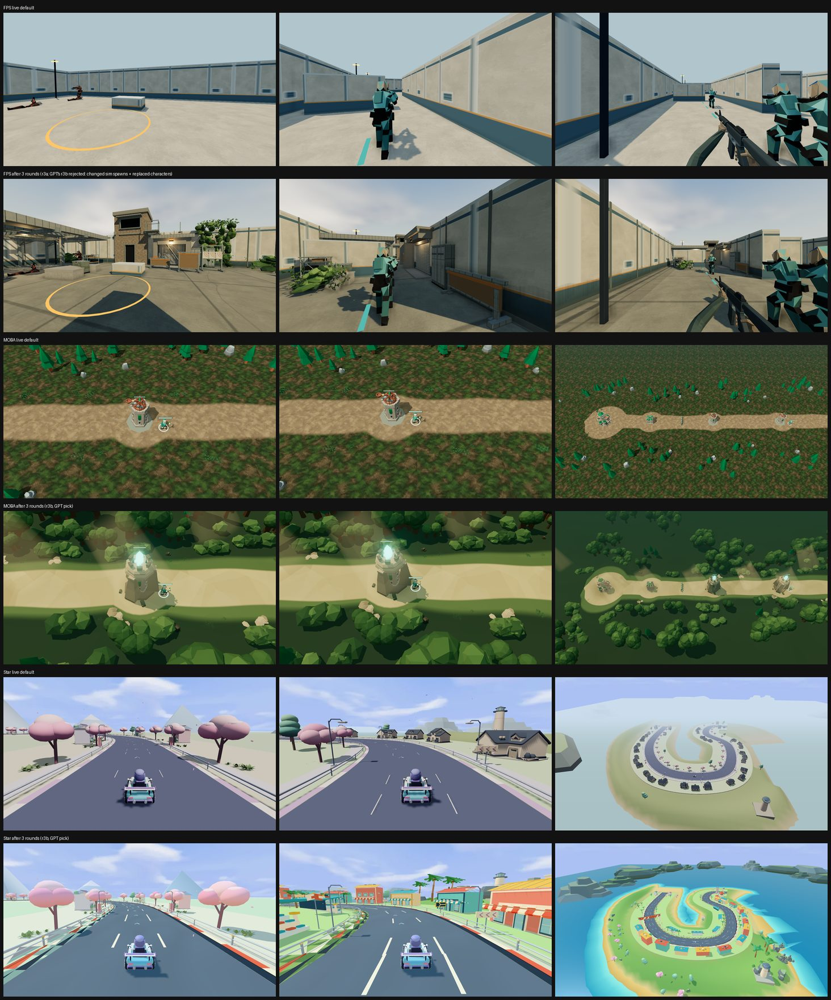

# 11-14 看图指导试跑：三案候选分支

方向会话按用户批准的重置方案第 2 步，在本机试跑了一次“强模型看图指导、免费模型实现”的循环，三案各留一个候选分支交 dot-B。它不是默认版本，也不改现行规则；是否换默认、采用整枝还是拆取单项，由 dot-B 按[游戏细则§6第3条](game-taskbook.md#6-作品案例)判。

## 做法

每轮：GPT-6.1 sol 看三个固定机位的 GPU 截图拼图（FPS 另附 Saltline 参照），写出稳妥、大胆两组改动 → 本机 DeepSeek 在独立工作树各实现一组并构建 → 本机硬件 GPU 无头拍同机位 → GPT 盲选（顺序轮换）并写下一轮。上限：每案 4 次 GPT 调用（3 轮实现＋终判）、每轮 2 个变体。三案并行约 1 小时 47 分；18 次 DeepSeek 实现全部构建成功，每次 12–40 分钟。

## 候选分支

| 案例 | 分支 | 画面变化 | 已知缺口 |
|---|---|---|---|
| FPS-Like | [`claude/look-guide-20261114`](https://github.com/dbvv1/FPS-Like/tree/claude/look-guide-20261114) | 雨棚、砖砌岗楼与楼梯、攀爬植物、储物柜、卷帘门、暖色壁灯和大块投影 | 新结构只渲染、无碰撞与导航；单测 471/471 过 |
| MOBA-Like | [`claude/look-guide-20261114`](https://github.com/dbvv1/MOBA-Like/tree/claude/look-guide-20261114) | 连续树冠包围兵线、林缘灌木、干净路面；外塔改遗迹塔，塔顶发光晶体与光束 | 俯视机位光束显成灰色矩形；塔失去红顶阵营色；`capture-world` 新增 6 个测试失败（测试替身缺 `getClearAlpha`），另 3 个文件在原提交上也失败 |
| Star-Rush-Reborn | [`claude/look-guide-20261114`](https://github.com/dbvv1/Star-Rush-Reborn/tree/claude/look-guide-20261114) | 岛屿外蓝色海水、沙滩与草地分区，弯道旁彩色商铺，路面与护栏重做，光照改 standard 材质 | **影响玩法**：海岸段新增最高 7.4 m 的高架段（s=780–1070）、护栏外移；测试 197/208（原提交 208/208）；训练场机位几乎没变 |

三案都只验了画面，没跑整局 smoke、帧耗和盲选。

## 试跑中学到的

- **有效**：每轮都由 GPT 判为比上一版明显更好，方向会话看对比图也认可多数；改动以加场景内容和分区为主，不是微调色。
- **免费模型会改玩法刷截图**：FPS 第 3 轮 GPT 选中的变体改了队友出生点、把角色全换成靶机，GPT 反而夸它；方向会话否决，FPS 分支取另一变体。自动化前需禁止改玩法／模拟和机位文件、在裁判提示中写明必须保留的对象，并由人或 Dot 终看。
- **位置偏差**：第 2、3 轮倒序重判 6 次，5 次结论不变；变的一次正是改了玩法的 FPS 变体。
- 是否把循环做进接收端、dot-B 的角色安排，等用户按重置方案第 3 步决定。

## 11-15 开关候选：可直接换默认

11-14 的三个分支改了玩法、有测试失败，不能直接换。11-15 去掉这些部分，从各案现行默认拉出 `claude/look-guide-gated-20261115`，只加一个 URL 开关。按[§6第3条](game-taskbook.md#6-作品案例)：三案都可当轮合入开关；MOBA、Star 的换默认证据已齐，可直接换；FPS 帧耗明显变差，先修再换（见下）。

| 案例 | 开关 | 去掉的试跑内容 |
|---|---|---|
| [FPS-Like](https://github.com/dbvv1/FPS-Like/tree/claude/look-guide-gated-20261115) | `dressing=courtyard-dressing-v1` | 无碰撞的掩体、器材箱、储物柜、楼梯、雨棚立柱（玩家和子弹会穿过）；新测试保证头部以下布景离墙不超过 35 cm |
| [MOBA-Like](https://github.com/dbvv1/MOBA-Like/tree/claude/look-guide-gated-20261115) | `scene=forest-lane-v1` | 走道内的树干、灌木、岩石和路肩石（单位会穿过）、走道内草坡、光柱；塔补回阵营色带；新测试保证走道内无遮挡物、地面平整 |
| [Star-Rush-Reborn](https://github.com/dbvv1/Star-Rush-Reborn/tree/claude/look-guide-gated-20261115) | `scene=coast-island-v1` | 海岸高架段（改行驶面）、护栏外移、改动的两处默认渲染测试；修了反向的弯道箭头牌和海岸尖片 |

| 证据 | FPS-Like | MOBA-Like | Star-Rush-Reborn |
|---|---|---|---|
| 开关关闭 | 三机位与默认逐像素一致 | 同左 | 同左 |
| 单测 | 474/474 | 600/601，失败的 1 项和另 2 个失败文件在原默认提交上同样失败 | 208/208 |
| 整局 smoke | 六回合、半场、终局重开两版都过 | 300 s 整局两版都过，终局相同 | 一圈整局两版都过，圈速同为 01:52.58 |
| 平均帧耗（默认→候选） | **5.11→9.06 ms（+77%）**，p95 7.5→12.4 | 5.42→5.64 ms（+4%），p95 9.0→9.3 | 0.73→0.86 ms（+19%），p95 1.5→2.1 |
| 盲选（3 机位×正反序） | GPT 6/6、Kimi 6/6 选新版 | 同左 | 同左（修复后重判） |

帧耗在本机 RTX 5070 硬件 GPU、关闭垂直同步和帧率上限下测；游戏代码即分支提交，只在本地临时改了 smoke 的浏览器参数（未推送）。Star 的 smoke 校验因此报“帧时长为 0”，平均值按总时长除帧数算。没有低端设备数据；软件渲染下 Star 候选约为默认的 2.5 倍（443 vs 180 ms），MOBA 约 1.6 倍，两版都远低于可玩帧率。MOBA 软件渲染时，整局后“Morrow E 技能区域存在”的断言在两版上同样失败，换 GPU 后通过，原因未查。

**FPS 待修（交 dot-B）**：逐项关掉候选各部分实测，开销全在布景几何，阴影类型、天空环境贴图、工作灯和地面贴图都可忽略。布景约数百个独立网格，每个盒子、支柱、叶片各占一次绘制并参与阴影。修法：生成后按材质（及叶片的阴影深度材质）合并静态网格，仿 `environment-kit.ts` 已用的 `mergeGeometries`，保持单测里的离墙检测仍能按物体判断；修后重跑 `FPS_SMOKE_RENDERER=gpu` 的 `smoke-backlog --dressing` 并比帧耗，盲选结论不受影响。

候选初始化失败时：MOBA 退回默认渲染并写明原因；Star 退到已有的 Canvas2D 兼容渲染并提示；FPS 布景是同步生成的几何，不加载资源也不换渲染器，由单测覆盖。

换默认时按各案以往做法改默认入口并补测试：FPS 在 `src/default-route.ts` 的首页查询串加开关；MOBA 照 79bdb57 在 `index.html` 和 `src/ui/entry-lighting.ts` 加默认场景；Star 在 `side-candidates.mjs` 让无 `scene` 参数时也开启，并改断言默认字节不变的测试，改动面最大。旧默认留作显式入口可回退。

盲选由 GPT-6.1 sol 与 Kimi K3.1 Pro 做。Kimi 没参与试跑，是非作者；GPT 写过试跑的改动指令，不算严格的非作者，换默认前请 dot-B 再找一位非作者复核。
